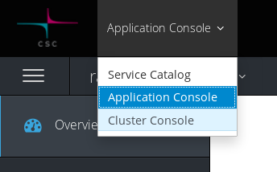
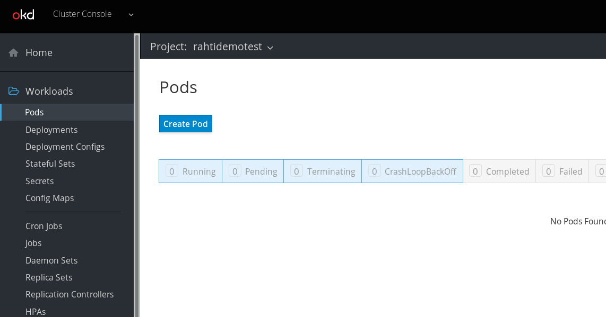
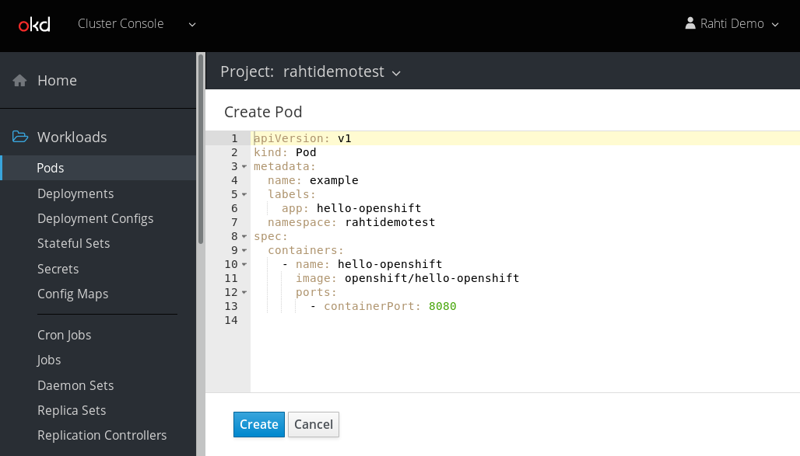
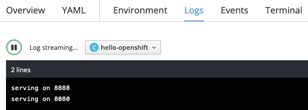

# Creating Containers
## The Openshift's hello-pod
* After being connected, switch to Cluster Console by selecting it in the drop menu located at the topbar:  

  

* Run container image `hello-openshift` in a pod called example:  
  Go to Workloads > Pods and click Create Pod:    
  
  

  Paste this code:  

  ```yaml
  apiVersion: v1
  kind: Pod
  metadata:
    name: example
    labels:
      app: hello-openshift
    namespace: rahtidemotest # Must match your namespace / project name
  spec:
    containers:
      - name: hello-openshift
        image: openshift/hello-openshift
        ports:
          - containerPort: 8080
  ```
  
  

* Click Create

* Get the standard output of the container by going to Applications > Pods  
  Click on your Pod (should be `example`) and go to Logs tab.  
  You should see this:
  


## Cleanup
On the pod page, click Action > Delete Pod