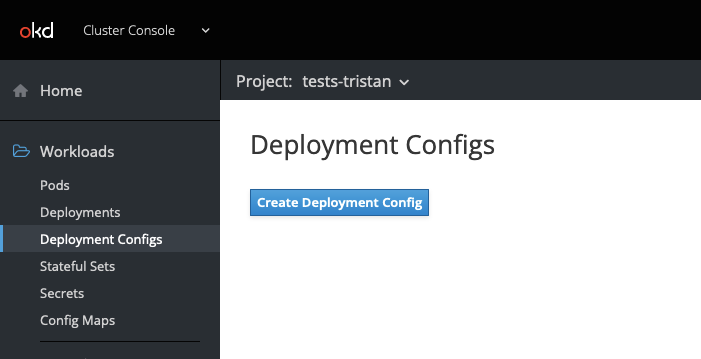
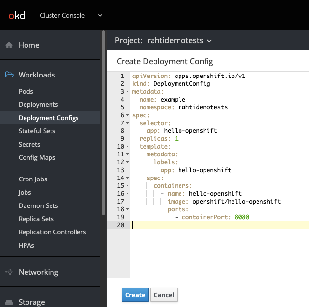
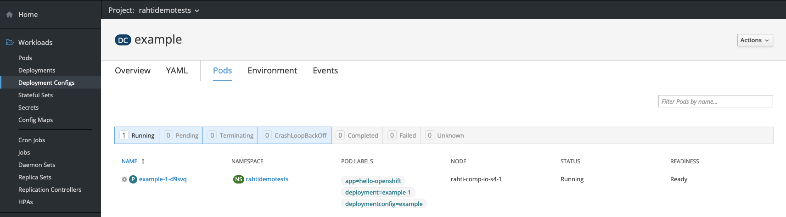
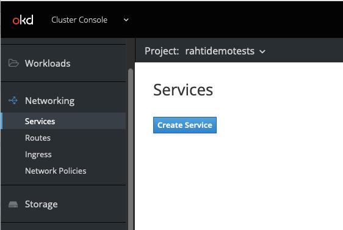
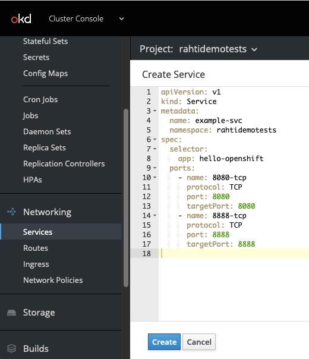
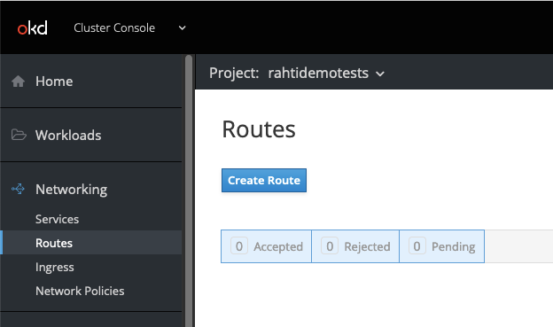
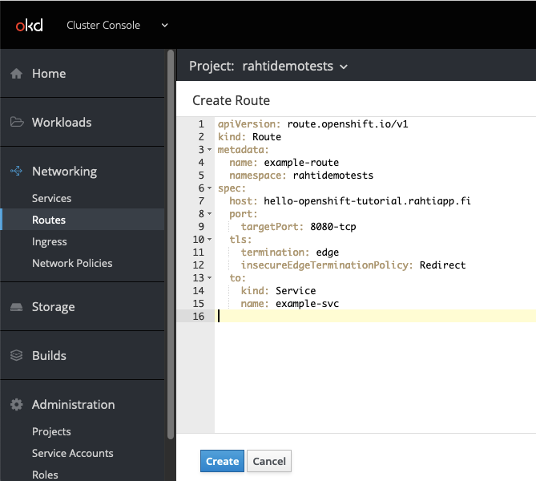

# Deploying Containerized Applications
## DeploymentConfig 
* Create a DeploymentConfig that will spawn a pod running image `openshift/hello-openshift`.  
Name it `hello-openshift` and label it `app: hello-openshift`.  
Create only one `replicas`.  
Apply the same label `app: hello-openshift` to the pods to be spawned as well.  

* Go to Workloads > DeploymentConfig and click Create Deployment Config:  


  Paste this code:

  ```yaml
  apiVersion: apps.openshift.io/v1
  kind: DeploymentConfig
  metadata:
    labels:
      app: hello-openshift
    name: hello-openshift
    namespace: rahtidemotests # Must match your namespace / project name
  spec:
    selector:
      app: hello-openshift
    replicas: 1
    template:
      metadata:
        labels:
          app: hello-openshift
      spec:
        containers:
        - name: hello-openshift
          image: openshift/hello-openshift
          ports:
          - containerPort: 8080
  ```

   

 * Click create  

 * You should see one pod running if you check the Pods tab in your Deployment Config:  

 


## Service
*  Create a Service object that will redirect traffic internally to the pod.

* Go to Networking > Services and click Create Service:  



Paste this code:

```yaml
kind: Service
apiVersion: v1
metadata:
  name: example-svc
  namespace: rahtidemotests # Must match your namespace / project name
spec:
  selector:
    app: hello-openshift # Must match your DeploymentConfig name
  ports:
    - name: 8080-tcp
      protocol: TCP
      port: 8080
      targetPort: 8080
    - name: 8888-tcp
      protocol: TCP
      port: 8888
      targetPort: 8888
```




## Route
* Expose the Service to internet at 'hello-openshift-xx.rahtiapp.fi'. (Where 'xx' is the number of the training account you are holding).

* Go to Networking > Routes and click Create



Paste this code:

```yaml
apiVersion: route.openshift.io/v1
kind: Route
metadata:
  name: example-route
  namespace: rahtidemotests
spec:
  host: hello-openshift-tutorial.rahtiapp.fi # Change the name
  port:
    targetPort: 8080-tcp # Must match your service port name 
  tls:
    termination: edge
    insecureEdgeTerminationPolicy: Redirect
  to:
    kind: Service
    name: example-svc # Must match your service name
```




## Accessing the application
* You can click on the newly created route to access the website. You should see "Hello Openshift!"


## Cleanup
1. On the DeploymentConfig page, click your Deployment Config > Actions > Delete Deployment Config
2. On the Service page, click your Service > Actions > Delete Service
3. On the Route page, clik your Route > Actions > Delete Route