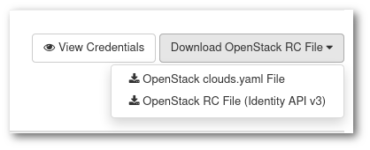

# OpenStack CLI

## 1. Install OpenStack CLI client and use it

> Pre-requisites, a VM like the one create in [Creating and Configuring VMs](03-CreateConfigVMs.html)

Log in to the VM and start installing the OpenStack CLI client. (You can also install it in your own workstation, but your mileage might vary).

### 1. Install the OpenStack CLI tool using [pip](https://pypi.org/project/pip/)

```sh
sudo yum -y install python3-devel python3-pip
sudo python3 -m pip install --upgrade pip
sudo pip3 install python-openstackclient
```

### 2. Get your openrc file

* Go to <https://pouta.csc.fi>
* Go to **Project > API Access** and click in **Download OpenRC File > OpenStack RC File (Identity API v3)**.



```sh
# scp SOURCE USER@DESTINATION:
$ scp path-of-downloaded-openrc-file cloud-user@your-floatingIP:openrc.sh
```

### 3. Source the openrc file

```sh
source openrc.sh
```

### 4. Check it works

```sh
openstack server list
```

### 5. Play with other OpenStack CLI commands

* Use https://docs.openstack.org/python-openstackclient/queens/ as a reference. If you are using a shard project, do not break the infrastructure of other's.

## 2. Upload an object to a Bucket using s3cmd client

> Pre-requisites, a VM like the one create in [Creating and Configuring VMs](03-CreateConfigVMs    .html). And the OpenShift client from the previous exercise

Log in to the VM you created and have the OpenStack client installed.

1. **Source the openrc.sh file, and enter your password when prompted**

    ```sh
    source openrc.sh
    ```

2. **Create OpenStack EC2 credentials**

    ```sh
    openstack ec2 credentials create
    ```

    * Write down the $SECRET_KEY and the $ACCESS_KEY. You may list them again by doing:

    ```sh
    openstack ec2 credentials list
    ```

3. **Install and configure the s3cmd tool**

    ```sh
    sudo yum install s3cmd
    s3cmd --configure --access_key=$ACCESS_KEY --secret_key=$SECRET_KEY \
        --host=a3s.fi --host-bucket='%(bucket)s.a3s.fi'
    ```
    
    * s3cmd will ask to confirm every configuration bit one by one. Then it will test the configuration and if successfull ask your confirmation before saving it.

4. **Upload a file to the bucket**

    * Create a file called yourlastname-2.txt
    * Upload it to a new bucket (YYYYMMDD-s3-ourlastname):

    ```sh
    s3cmd mb s3://YYYYMMDD-s3-yourlastname
    s3cmd put yourlastname-2.txt s3://YYYYMMDD-s3-yourlastname/yourlastname2.txt -P
    ```

5. **Check it works**

    * You can use your browser or Curl with the URL above. Using curl:

    ```sh
    curl https://a3s.fi/YYYYMMDD-s3-yourlastname/yourlastname2.txt
    ```
