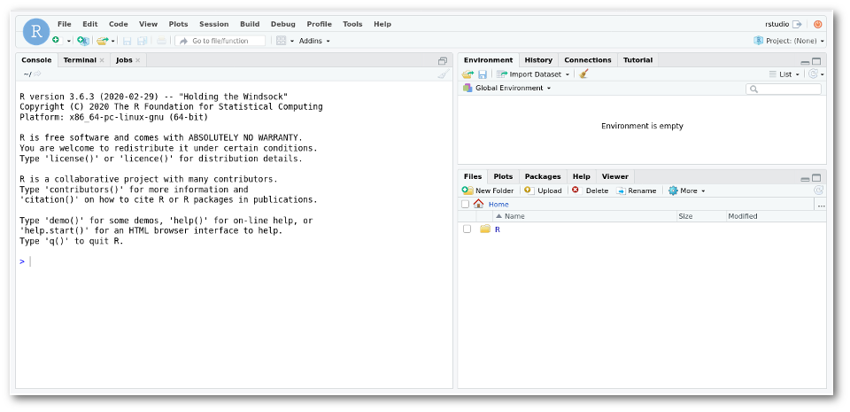

# Deploying Applications on VMs

## 1. Install Docker CE & run RStudio server in Docker Container

> Pre-requisites, a VM like the one create in [Creating and Configuring VMs](03-CreateConfigVMs.html)

In this exercise we will run some commands to run RStudio in docker and check the results.

1. **Install Docker CE on your VM**

    ```sh
    sudo yum install -y yum-utils device-mapper-persistent-data lvm2
    sudo yum-config-manager --add-repo https://download.docker.com/linux/centos/docker-ce.repo
    sudo yum install docker-ce
    ```

1. **Enable and Start Docker CE on your VM**

    ```sh
    sudo systemctl enable --now docker
    ```

1. **Test if Docker CE was successfully started on your VM**

    ```sh
    sudo docker run hello-world
    ```

1. **Run Rstudio docker container**

    ```sh
    sudo docker container run --rm -p 80:8787 -d -v ${PWD}:/home/rstudio -w /home/rstudio dceoy/rstudio-server
    ```

    > Alternative image location: `quay.io/lvarin/rstudio-server`

1. **Access Rstudio server**
    * Use <http://VM-IP> (remember to open the TCP port 80 (HTTP) in the VM using Security Groups).
    * Login in the Rstudio server with user: `rstudio`, and password: `rstudio`.
    * You should see a page like this:

    

1. **Stop Rstudio server**

    ```sh
    sudo docker stop $(sudo docker ps -q)
    ```

## 2. Install RStudio Server

> Pre-requisites, a VM like the one create in [Creating and Configuring VMs](03-CreateConfigVMs.html)

In this exercise we will run some commands to build RStudio and check the results.

1. **Update the VM**

    ```sh
    sudo yum update
    ```

1. **Download Rstudio rpm installation package**

    ```sh
    wget https://download2.rstudio.org/rstudio-server-rhel-1.1.456-x86_64.rpm
    ```

1. **Install rstudio**

    ```sh
    sudo yum localinstall rstudio-server-rhel-1.1.456-x86_64.rpm -y
    sudo yum install R -y
    sudo rstudio-server verify-installation
    ```

1. **Add a new user account to your system**

    ```sh
    sudo useradd rstudio
    sudo passwd rstudio
    ```

    * The second command will ask you for a new password. This is the same password you will use to login in Rstudio.

1. **Access Rstudio server**
    * Use <http://VM-IP:8787> (remember to open port 8787 in the VM using Security Groups).
    * Login in the Rstudio server with user: `rstudio`, and the password you provided in the previous step.

## 3. Installing software with Conda

> Pre-requisites, a VM like the one create in [Creating and Configuring VMs](03-CreateConfigVMs.html)

1. **Install bzip2 compression tool**

    ```sh
    sudo yum update
    sudo yum install bzip2
    ```

1. **Download and install Conda into the VM**

    ```sh
    wget https://repo.continuum.io/miniconda/Miniconda3-latest-Linux-x86_64.sh
    bash Miniconda3-latest-Linux-x86_64.sh
    source .bashrc
    ```

1. **Add the software channels**

    ```sh
    conda config --add channels defaults
    conda config --add channels conda-forge
    conda config --add channels bioconda
    ```

1. **Use Conda to install software**

    ```sh
    conda install bwa
    ```

1. **Browse the packages available in the Bioconda repository**
    * <https://bioconda.github.io/recipes.html#recipes>

1. **Create a new environment**

    ```sh
    conda create -n bwa_env bwa
    conda info --envs
    source activate my_env
    ```

## 4. Installing MySQL server in an Ubuntu VM

In this exercise we will install a MySQL server. In the HPC world is common to need a database to coordinate the analysis and store the results.

1. **Launch a Virtual machine**

    * Launch a virtual machine using the most recent Ubuntu image available (Ubuntu 22.04). You may use the same instructions as in [Creating and Configuring VMs](03-CreateConfigVMs.html), but selecting the "Ubuntu" image instead of "Centos".

1. **Install the database**
    
    ```sh
    sudo apt update
    sudo apt install mysql-server mysql-client -y
    ```

1. **Configure MySQL users**

    ```sh
    sudo mysql_secure_installation
    sudo mysql -e "CREATE USER 'dbuser'@'%' IDENTIFIED  WITH mysql_native_password BY 'fakePassword12345';"
    ```

1. **Open MySQL to the internet**

    * Use a security group to open the port (`3306`)

    * In `/etc/mysql/mysql.conf.d/mysqld.cnf`, change the line `bind-address = 127.0.0.1` into `bind-address = 0.0.0.0`. This makes MySQL to listen to any IP and not only the localhost (`127.0.0.1`). Then restart the MySQL Service.


    * When connecting, MySQL will ask for the password that was created earlier.

    ```sh
    mysql -u dbuser -p -h **virtual-ip**
    ```

    * Remember to remove the Virtual machine afterwards.

