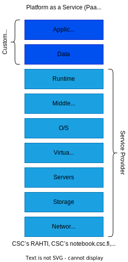

layout: false
class: topicslide

.topic[

# What is Rahti?

## PaaS cloud

]

---

#  Rahti

.container[.col70[

.bubble.bubble-bottom-left[
The Rahti Cloud is CSC's **Platform as a Service** (PaaS) offering. Based on [OpenShift](https://www.okd.io/)/[Kubernetes](https://kubernetes.io/).
]

## 😐

.bubble.bubble-bottom-left[
  Allows to run **Containers** on CSC's Data Center infrastructure. Provides the infrastructure (**OS**, **Middleware**, **Runtime**, ...), so you can just worry about running the Software and nothing else.
  ]

## 😶

].col[



]]

---

# Rahti advantages

.container[.col60[

* Out of the box:
  * **health monitoring**, resource consumption, and liveness and readiness probes.
  * **scaling**, resources can be configured to scale up or down (fine grained lower limit) responding to load. (faster than VMs)
  * **failover**, in case of any failure, like hardware failure, the software will be restarted.
  * **rolling updates**, a new version of an application will be deployed with no downtime.
  * **load balancing**, automatically distributes load among resources.
  * **DNS**, no need to make any support request or wait\*.footnote[\*For a given pattern of URLs. `something.rahtiapp.fi`].
  * **certificates**, always valid, automatically renewed*.

  ]
.col[
  .right[]
]]

---

# More Rahti advantages

.container[.col60[

* Simple code deploying:
  * Source code. Rahti provides tools to build and deploy code automatically. **Source2Image (S2I)**.
  * Internal Rahti **template catalog**.
  * Upstream **Helm** charts.

* Support in the **web interface**:
  * Launch applications
  * Tune application parameters
  * Request storage
  * Debug and monitor applications
  * Check logs

* Also powerful **CLI** and **library** interfaces.

  ]
.col[
  .right[]
]]

---

# Interacting with Rahti control plane

.container[
.col.center[

### Web console

.fillimg[


]
]
.col.padleft[
.center[ ### Command line ]

```sh
oc create -f pod.yaml
oc replace --force pod.yaml
oc apply -f *.yaml
oc patch ...
oc expose ...
```

]
.col.padleft[
.center[ ### Using client library ]

```python
from kubernetes import client, config

k8s = config.new_client_from_config()
# etc...
```

.small[

* Official: Go, Python, Java, dotnet, JavaScript
* Community maintained: Clojure, Go, Java, Lisp, Node.js, Perl, PHP, Python, Ruby, Rust, Scala, dotNet, Elixir, Haskell]

]]

---

# Web console

.tighter[

### Service catalog .padleft[] .gray[Application console .padleft[] Cluster console]

]
.container[
.col[

* The default opening viewport
* Create projects
* Launch applications from templates
* Deploy from images

]
.padleft.maxhalf.col[
.fillimg[

]]]

---

# Web console

.tighter[

### .gray[Service catalog] .padleft[] Application console .padleft[] .gray[Cluster console]

]
.container[
.col[

* Create some API objects
* Deploy images
* Claim storage
* View and modify workloads and API objects

* Monitoring
]
.padleft.maxhalf.col[


]]

---

# Web console

.tighter[

### .gray[Service catalog .padleft[] Application console] .padleft[] Cluster console

]
.container[
.col[

* Similar to application console but with different arrangement
* More fine-grained
]
.padleft.maxhalf.col[


]]


