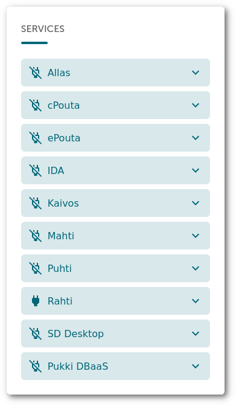

layout: false
class: topicslide

.topic[

# Getting Access to Rahti

]

---

# CSC account

.container[.col60[

In order to access Rahti, you first need a CSC account. There are two ways to obtain an account:

* [Getting an account with Haka or Virtu](https://docs.csc.fi/accounts/how-to-create-new-user-account/#getting-an-account-without-haka-or-virtu). If your home organization is a member of the Haka or Virtu federation, you can create an account yourself.

* [Getting an account without Haka or Virtu](https://docs.csc.fi/accounts/how-to-create-new-user-account/#getting-an-account-without-haka-or-virtu), by contacting <servicedesk@csc.fi>

If you already have an account, you can visit:

<https://my.csc.fi/myProfile>

There you will be able to see and edit the account details, like change your password.

].col[

.center[]

]]

---

.container[.col[

# Project access

Once you have an account, you need access to a project with Rahti access. You can get access with two different roles:

* As [project manager](https://docs.csc.fi/accounts/how-to-add-service-access-for-project/#project-manager)
* As a [member](https://docs.csc.fi/accounts/how-to-add-service-access-for-project/#member)

Once you have access to a Project, make sure that the **Rahti** service is activated.

In the figure you can see that only `Rahti` is activated.

].col[

.center[]

]]

---

# Log in on Rahti's web console

.container[
  .col[

* Navigate to [https://rahti.csc.fi:8443](https://rahti.csc.fi:8443).
* Use your CSC account to login

]

.col[

]]

