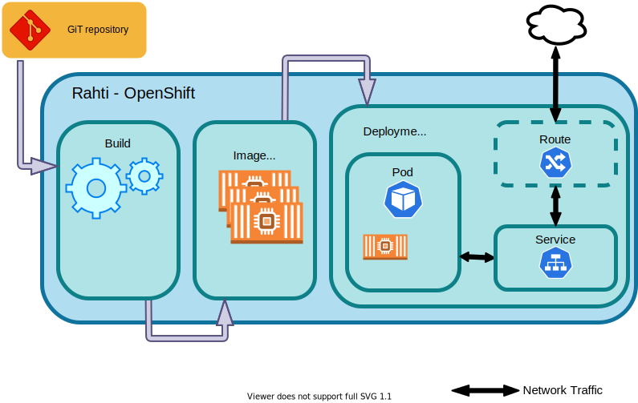
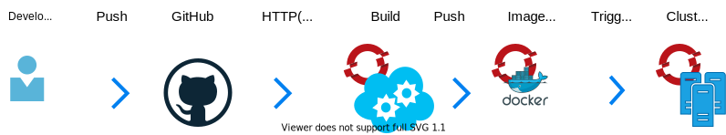

layout: false
class: topicslide

.topic[

# Creating Containers 

]

---

# Source2Image

.container[.col[

Automatically builds and deploys code into Rahti:

* Receives a GiT repository. Clones and analyses it. 

* Builds the container **image**.

* Stores the image in the project registry

* Deploys the application

].col[

```sh
oc new-app https://github.com/sclorg/django-ex
oc expose svc django-ex
```



]]

<https://docs.csc.fi/cloud/rahti/images/creating/#using-the-source-to-image-mechanism>

---

# Local build

Build an image from you local computer using a [Dockerfile](https://docs.docker.com/engine/reference/builder/) "recipe".

.container[.col[

* Dockerfile example:

```Dockerfile
FROM centos/python-38-centos7
COPY . /opt/app-root/
WORKDIR /opt/app-root/
RUN pip install -r requirements.txt
ENTRYPOINT ["/usr/libexec/s2i/run"]|
```

Similar to what a Source2Image process will do

].col[

* Build:

    * with: `docker build .`
    * with: `buildah bud --format=docker`
    * with: `docker buildx build .` 

Different tools with different use cases in mind. 
]]

---

# Auto triggered builds



When a developer pushes code, an automatic process is started to bring changes to Rahti.

.container[.col[

1. Code is pushed

1. GitHub\* .footnote[\* or Gitlab, or any other alternative] has internal logic to trigger or not a build 

1. After the build is done, the image is stored internally

1. A new image triggers a re-deployment

].col[

Set it up by:

* Create build: `oc new-build <git_URL>`

* Add the web hook:
    * <https://docs.csc.fi/cloud/rahti/tutorials/webhooks/> 

]]


