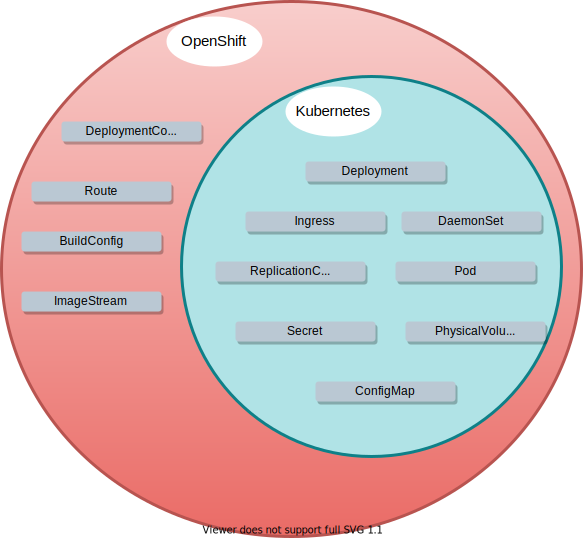

layout: false
class: topicslide

.topic[

# Kubernetes and OpenShift

## CLI and API

]

---

# API Objects

In Kubernetes/OpenShift everything is an object. Each object represents the **desired and current state** of an aspect of the application. 

.container[
  .col[

* Categories:
  * Network
  * Container, management and creation
  * Job scheduling
  * Runtime of containers

* Represented in JSON or YAML format

]
  .col70[
.center[]
  ]]

---

# OpenShift Command Line Interface

.container[.col[

The most common advanced way to interact with the API is using the _command line interface_ tools.

* `kubectl`, the Kubernetes command-line tool.

    * [Install kubectl](https://kubernetes.io/docs/tasks/tools/install-kubectl-linux/)

* `oc`, the OpenShift command-line tool. `oc` features are a superset and has the same interface than `kubectl`.
    * [How to install the oc tool](https://docs.csc.fi/cloud/rahti/usage/cli/#how-to-install-the-oc-tool)

].col[

.right[]

]]

---

# Command line operations

The following are the most common command line operations:

.container[.col60[

* **LOGIN**, `oc login`. Could take a TOKEN or a username/password.
* **PROJECT MANAGEMENT**, `oc projects` and `oc new-project`. List, switch, and create projects.
* **INFORMATION**, `oc get` and `oc describe`. Describe is more detailed and human friendly, and get is more machine friendly (JSON and YAML outputs).
* **CREATE**, `oc create`.
* **MODIFY**, `oc edit` and `oc replace`. Edit is interactive.
* **DELETE**, `oc delete`.

].col[

.right[]

]]

---

# Project

A project sandboxes API objects (Pods and others) in a common namespace.
.container[
  .col[

* Similar to **Namespace**
  * (with extra features)
* Local **isolated network**
  * For security reasons, projects can not access other projects by default.
* A project has:
  * **Name**: Should be short and descriptive
  * **Display Name**: Should be understandable
  * **Description**: Must be `csc_project: 9999999`
        * where `9999999` is the project number


].col[

]]

---

# Pod

.container[
.col[

* A pod is a collection of **containers** sharing a network and Inter-process communication namespace
  * Containers live in one pod
* There is no *container object* in Kubernetes
* Nearly always one container per pod
  * Ex: Sidecar container design pattern

]
.maxhalf.col.padleft[
.boxcol.container[
.col[

```yaml
# my-pod.yaml
kind: Pod
apiVersion: v1
metadata:
 name: my-pod
spec:
 containers:
 - name: container-1
   image: container-1-image
 - name: container-2
   image: container-2-image
```

]
.padleft.scaleimg.col[
.center[
]]]

Communicate via:

* localhost (network)
* shared folders (emptyDir)
* memory (Inter-process communication)

]]

---

# Service

An API object that provides pods a **load balanced** stable network identity.

.container[

.col[

* The IP of a Pod **may change**, the **IP** of a Service **will not change**.
  * Pods should communicate with each other using services

]
.col[

.center[]

]]

---

# Route

.container[
.col[

An API object that exposes a Service to the internet via HTTP/HTTPS.

* Every host with the pattern `*.rahtiapp.fi` will point **automatically** to Rahti:
  * `my-hello-openshift.rahtiapp.fi` is an alias for `rahtiapp.fi`.

  * If the host must be different to this pattern, a `DNS CNAME` entry must be configured by the user to point to `rahtiapp.fi`.
* Every host with the pattern `*.rahtiapp.fi` will have automatically a valid **TLS certificate**.

]

.col[

.center[]

]]

