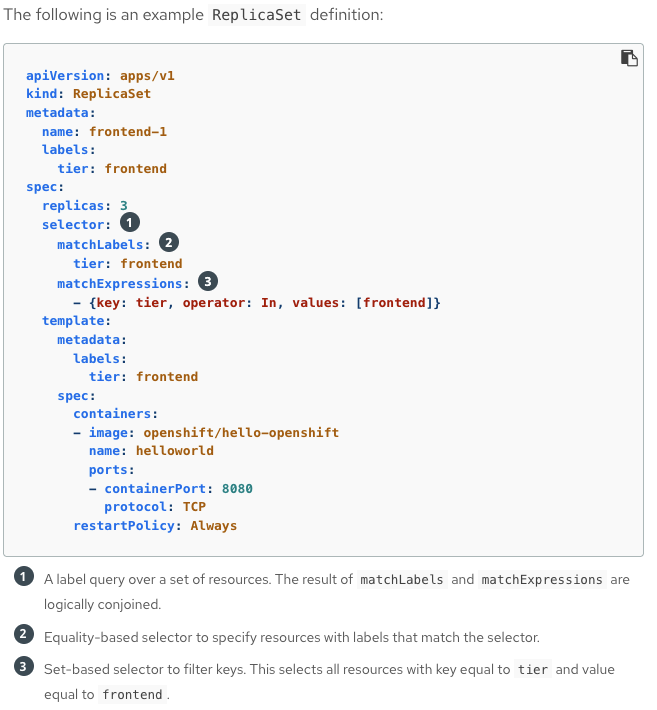
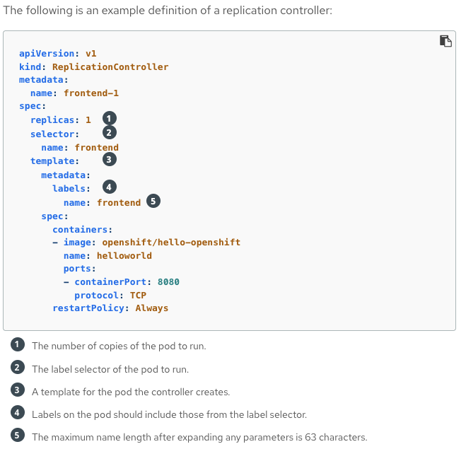
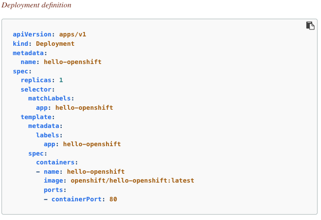
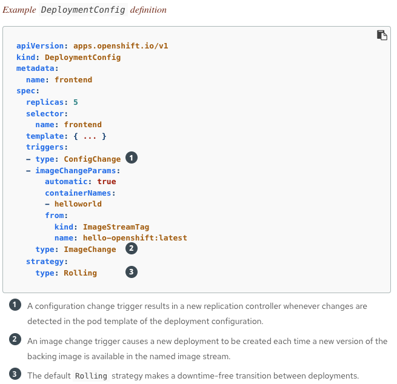
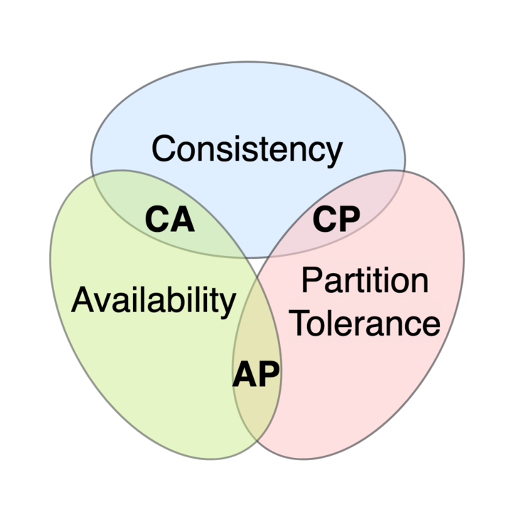

layout: false
class: topicslide

.topic[

# Deployment of Applications

### Deployment and DeploymentConfig objects

]

---

.container[
.col[
## Deployment  
Deployment objects involve one or more replica sets, which contain a point-in-time record of the state of a deployment as a pod template.
]
.col[
##  DeploymentConfig  
DeploymentConfig objects involve one or more replication controllers, which preceded replica sets.
]]
Use Deployment object unless you need a specific feature or behavior provided by DeploymentConfig objects.

---

# Replica sets
.container[
.col[
- Is a native Kubernetes API object that ensures a specified number of pod replicas are running at any given time.
- It supports **set-based** selector requirements.  
  (**Set-based** label requirements allow filtering keys according to a set of values)
]
.col[

]]

---

# Replication controllers
.container[
.col[
Similar to a replica set: 
- Ensures that a specified number of replicas of a pod are running at all times. 
But
- If there are more running pods than desired, it deletes as many as necessary to match the defined amount.
- It only supports equality-based selector requirements.  
  (**Equality-based** label requirements allow filtering by label keys and values)  
A selector is a set of labels assigned to the pods that are managed by the replication controller.
]
.col[

]]

---

# Deployment
.container[
.col[
- Kubernetes provides a first-class, native API object type in OpenShift Container Platform called Deployment.
- Deployment objects:
  - Describe the desired state of a component of an application.
  - They create replica sets, which orchestrate pod lifecycles
]
.col[
    
]]

---

# DeploymentConfig
.container[
.col[
Provides:
- A DeploymentConfig object which creates a new Replication Controller and lets it start up pods.
- Triggers that automated deployments (Wehbooks, Code change, Image change ...)
- Versioning of application to allow rollbacks either manually of automatically.
- Manual replication scaling and autoscaling
]
.col[
 
]]
Replication controllers are created when a DeploymentConfig is created.

---

# So, which one?
.container[
.col[
- Both are supported in Openshift Container Platform
- **DeploymentConfig**... 
  - Objects prefer consistency
  - Automatic rolling back to the last successfully deployed replica set in case of a failure.
  - Support lifecycle hooks.
  - Custom strategies.
- **Deployment**... 
  - Objects prefer availavility over consistency
  - Implicit config change trigger in every change in the pod template or deployment. Can be paused.
]
.col[

]]
