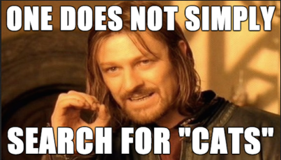

layout: false
class: topicslide

.topic[

# Packaging Containerized Applications

## Helm

]

---

# What is Helm?
Helm is like a package (called **charts**) manager for Kubernetes and helps you manage Kunernetes applications.  
Helm charts help you define, install and upgrade Kubernetes application.

---

# Helm architecture
.container[
.col[
Three important concepts:
- **chart**: A bundle of information necessary to reate an instance of a Kubernetes application.
- **config**: It contains configuration information that can be merged into a packaged chart.
- **release**: A running instance of a chart combined with a specific config.  

**Helm** is implemented into two distincts parts:
- Helm Client:
  - Local chart development
  - Managing repositories
  - Managing releases
  - Interfacing with Helm librairy (charts to be installed, upgrade or uninstall existing releases)
- Helm Library
  - Interface with the Kubernetes API server
  - Combine chart and configuration to build a release
  - Install chart into Kubernetes
  - Upgrade and uninstall charts by interaction with Kubernetes
]
.col[

]]

---

# Helm packages search
Two commands:
- `helm search hub`
- `helm search repo`  
.container[
.col[
### helm search hub  
This command search charts from repositories on Artifact Hub
]
.col[
### helm search repo
This command search charts from your Helm configuration.  
Type `helm` to find the location of your config file.
]]
.center[]

---

# Helm packages manager
As easy as package manager from Linux systems:
- `helm repo add`: Add a repository
- `helm repo list`: List your installed repository
- `helm repo update`: Update the index and allows you to benefit from the latest versions of packages.

---

# Helm packages installation
One command: `helm install`
It may requires the installation of a repository before:
- `helm repo add ....`
- `helm repo update`
- `helm repo search ....`
- `helm install [NAME] [CHART]`  
After your installation, you can list your releases with the command `helm ls` (Use `-A` for all namespaces)

---

# What's next?
Helm allows you to build your own charts, more explication in the exercice [Packaging Containerized Applications](../_exercises-containers/12-AppPackaging.md)

